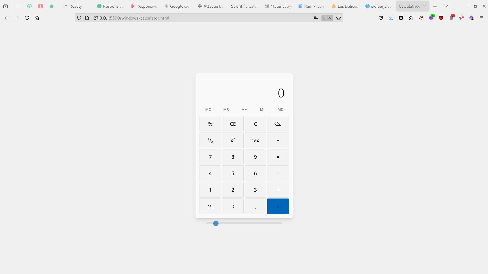

# Calculatrice Windows Clone

 

Une implémentation web d'une calculatrice standard, inspirée par l'interface et les fonctionnalités de la calculatrice de Windows. Ce projet est construit en utilisant HTML, CSS (avec Tailwind CSS) et JavaScript pur, offrant une expérience utilisateur familière et réactive.

## Table des matières

- [Fonctionnalités](#fonctionnalités)
- [Technologies Utilisées](#technologies-utilisées)
- [Comment Utiliser](#comment-utiliser)
- [Personnalisation](#personnalisation)
- [Contribution](#contribution)
- [Licence](#licence)

## Fonctionnalités

Cette calculatrice inclut les fonctionnalités clés que l'on retrouve dans la calculatrice de Windows :

- **Opérations Arithmétiques de Base :** Addition, Soustraction, Multiplication, Division.
- **Fonctions Spéciales :**
    - Pourcentage ("%")
    - Inverse ()
    - Carré ()
    - Racine carrée ()
    - Changement de signe ()
- **Gestion de la Mémoire :**
    - Effacer la mémoire (MC)
    - Rappeler la mémoire (MR)
    - Ajouter à la mémoire (M+)
    - Enlever un chiffre sauvegarde au prealable dans la mémoire (M-)
    - Stocker des chiffres en  mémoire (MS)
- **Contrôles d'Entrée :**
    - Effacer l'entrée actuelle (CE)
    - Tout effacer (C)
    - Retour arrière (⌫)
- **Affichage :**
    - Affichage de l'entrée/résultat actuel.
    - Affichage de l'historique des opérations.
- **Support Clavier :** Utilisation de la calculatrice via le clavier pour une saisie rapide.
- **Réglage d'Affichage :** Un curseur pour ajuster la taille de la police de l'affichage principal.
- **Design Responsive :** S'adapte à différentes tailles d'écran (ordinateurs de bureau, tablettes, mobiles).

## Technologies Utilisées

- **HTML5 :** Pour la structure de la page.
- **CSS3 :** Pour le style et la mise en page, utilisant le framework [Tailwind CSS](https://tailwindcss.com/) via CDN pour une stylisation beaucoup plus rapide .
- **JavaScript (ES6+) :** Pour la logique interactive de la calculatrice.

## Comment Utiliser

Pour utiliser cette calculatrice :

1.  **Clonez le dépôt** (si c'est un dépôt Git) ou téléchargez les fichiers "index.html", 'calculatrice.png' et les autres fichiers du projet dans un dossier local.
2.  **Ouvrez le fichier [windows-calculator.html](windows-calculator.html) ** dans votre navigateur web préféré.

C'est une application web statique, donc aucun serveur n'est nécessaire pour la faire fonctionner.

## Personnalisation

Le code est structuré de manière à être facilement modifiable : 

-   **HTML :** Modifiez la structure des boutons ou des affichages dans le document HTML5  [windows-calculator.html](/windows-calculator.html) .
-   **CSS :** Les styles sont définis dans le fichier [style.css](assets/css/style.css) . Vous pouvez modifier les couleurs, les tailles ou les espacements pour correspondre à vos préférences. Les classes Tailwind sont également utilisées pour un prototypage rapide du style.
-   **JavaScript :** La logique de la calculatrice est contenue dans le fichier  [calculator.js](assets/js/calculator.js). Les commentaires détaillés vous aideront à comprendre et à modifier le comportement des boutons et des calculs.

## Contribution

Les contributions sont les bienvenues ! Si vous avez des idées d'amélioration, des corrections de bugs ou de nouvelles fonctionnalités, n'hésitez pas à :

1.  Faire un "fork" du dépôt.
2.  Créer une nouvelle branche (`git checkout -b feature/nouvelle-fonctionnalite`).
3.  Effectuer vos modifications.
4.  "Commiter" vos changements (`git commit -m 'feat: ajoute une nouvelle fonctionnalité'`).
5.  "Pusher" vers votre branche (`git push origin feature/nouvelle-fonctionnalite`).
6.  Ouvrir une "Pull Request".

## Licence

Ce projet est sous licence [MIT License](LICENSE). Vous êtes libre de l'utiliser, de le modifier et de le distribuer à condition de respecter les termes de la dite licence.